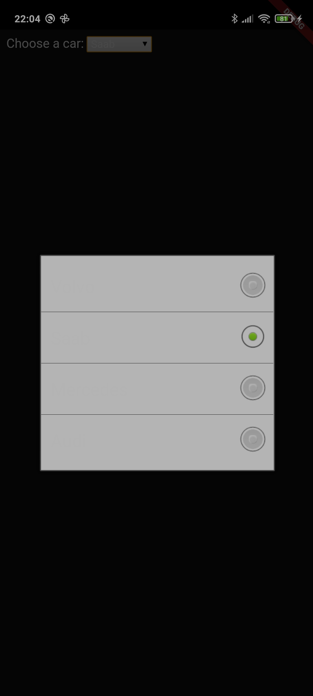

# webview - unreadable text in dark mode

This is just a demo for one bug with *webview_flutter* and Android when the device is set to dark mode.
In this case on my phone the entries of an html select box were not visible, because they were shown as white text on white background.
Switching to the normal light mode in the Android settings and everything is shown correctly.

This is how it looks like in Android dark mode, text is not visible:

This is how it looks like in Android light mode, text is visible:

